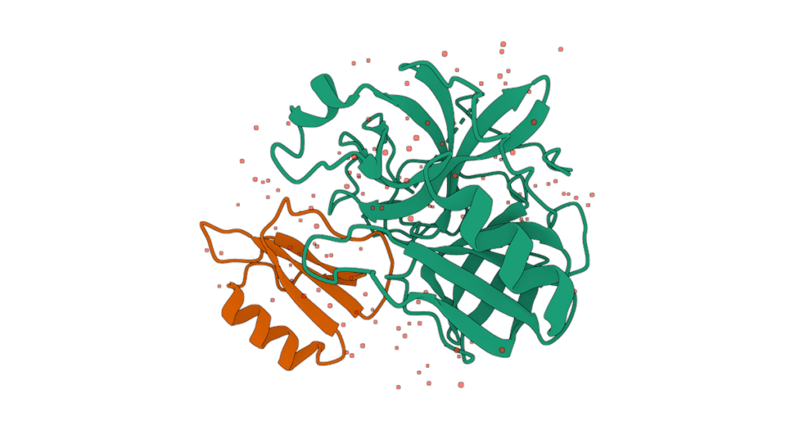
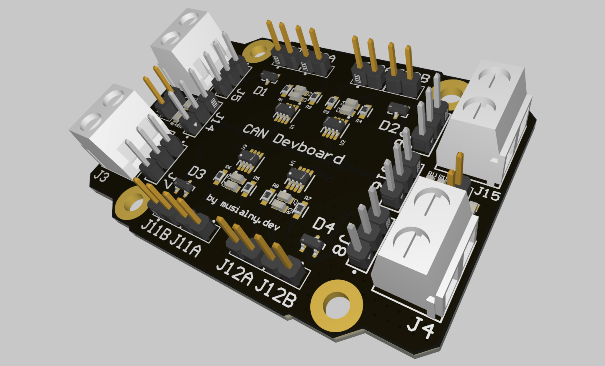

# Łukasz Musiał | musialny.dev

Full Stack Developer | **Computer & Electronics Engineering**

---

### Experience

#### Data Viz at [@blacklabel](https://github.com/blacklabel) 
<table>
  <tr>
    <td width="50%" style="text-align: right;">
      
    </td>
    <td width="50%">
      

        I develop data visualisation solutions. At <a href="https://github.com/blacklabel">@blacklabel</a> I work on a biotechnology project, building interactive molecular visuals using libraries such as <a href="https://molstar.org/">Mol*</a> and <a href="https://github.com/rcsb/rcsb-saguaro">RCSB Saguaro</a>.
      

    </td>
  </tr>
</table>

---

### Formula Student (PK Mech Power) Experience

<table>
  <tr>
    <td width="50%">
      

        I develop software and electronics hardware (PCB) for the electric car power‑train control system of a race car competing in the Formula Student international competitions. This hands‑on experience gave me insight into integrating software with hardware in demanding automotive applications.
      

    </td>
    <td width="50%" style="text-align: right;">
      
    </td>
  </tr>
</table>

---

#### PCB Design and Embedded Development
<table>
  <tr>
    <td width="50%" style="text-align: right;">
      
    </td>
    <td width="50%">
      

I design PCBs and develop embedded systems, with experience in communication protocols such as CAN. My work focuses on creating modular, reliable hardware for rapid prototyping and testing.

As an example, I built the CAN_Devboard — a custom PCB that enables quick testing of multiple devboards and external devices on a CAN bus, streamlining debugging and development.
      

    </td>
  </tr>
</table>

---

### About Me

Engineer with a background in software and electrical engineering, focused on embedded software, operating systems and distributed systems. I'm passionate about DevOps and modern web development, and deeply interested in hardware; from FPGA/ASIC design and integrated circuits to automotive applications such as electric vehicle powertrains; bridging software and hardware for highly optimised systems.

### Skills

#### Software Engineering

**Native applications (desktop, server & mobile)**

- [C++](https://isocpp.org), [C](https://en.wikipedia.org/wiki/C_(programming_language)), [Kotlin](https://kotlinlang.org), [Swift](https://swift.org)
- [CMake](https://cmake.org), [Gradle](https://gradle.org)

**Web development (full stack)**

- [TypeScript](https://www.typescriptlang.org), [JavaScript](https://developer.mozilla.org/en-US/docs/Web/JavaScript), [Kotlin](https://kotlinlang.org)
- [Vue.js](https://vuejs.org), [Webpack](https://webpack.js.org), [Vite](https://vitejs.dev)
- [Yarn](https://yarnpkg.com), [ESLint](https://eslint.org), [Node.js](https://nodejs.org)
- [SASS](https://sass-lang.com), [WebAssembly (Wasm)](https://webassembly.org), [Emscripten](https://emscripten.org)

#### Embedded & Electronics Engineering

- Assembly (AVR / ARM / x86)
- [C](https://en.wikipedia.org/wiki/C_(programming_language)), [C++](https://isocpp.org)
- [Clang / LLVM](https://llvm.org), [GCC](https://gcc.gnu.org)
- AVR 8‑bit, STM32, RPi Pico MCU series
- PCB design with [Altium Designer](https://www.altium.com/altium-designer)
- Circuit and electromagnetic simulations (EMI, SI etc.)
- Hardware description languages: [VHDL](https://en.wikipedia.org/wiki/VHDL), [SystemVerilog](https://en.wikipedia.org/wiki/SystemVerilog)
- Electromechanical design with [SolidWorks](https://www.solidworks.com)

#### Network Infrastructure & DevOps

- [Linux](https://www.linux.org) (SysOps)
- [Docker](https://www.docker.com), [Kubernetes](https://kubernetes.io)
- [LXD / LXC](https://linuxcontainers.org), [Proxmox](https://www.proxmox.com)

---
