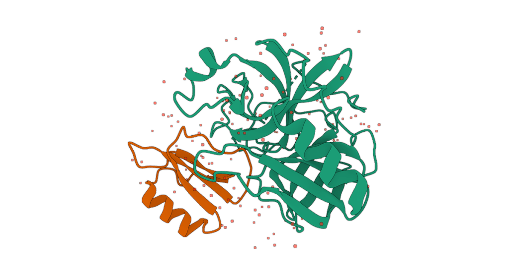
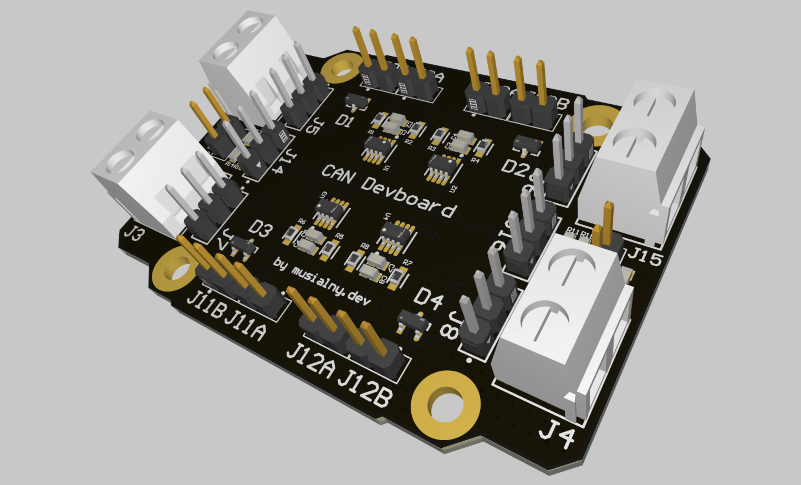

# Łukasz Musiał | musialny.dev

Full Stack & Embedded Developer | PCB & HDL Designer | EV Powertrain

---

### Experience

#### Data Viz at [@blacklabel](https://github.com/blacklabel)
<table>
  <tr>
    <td width="50%" style="text-align: right;">
      
    </td>
    <td width="50%">
      

        I develop data visualisation solutions. At <a href="https://github.com/blacklabel">@blacklabel</a> I work on a biotechnology project, building interactive molecular visuals using libraries such as <a href="https://molstar.org/">Mol*</a> and <a href="https://github.com/rcsb/rcsb-saguaro">RCSB Saguaro</a>.
      

    </td>
  </tr>
</table>

---

### Formula Student (PK Mech Power) Experience

<table>
  <tr>
    <td width="50%">
      

        I develop software and electronics hardware (PCB) for the electric car power‑train control system of a race car competing in the Formula Student international competitions. This hands‑on experience gave me insight into integrating software with hardware in demanding automotive applications.
      

    </td>
    <td width="50%" style="text-align: right;">
      
    </td>
  </tr>
</table>

---

#### PCB Design and Embedded Development
<table>
  <tr>
    <td width="50%" style="text-align: right;">
      
    </td>
    <td width="50%">
      

I design PCBs and develop embedded systems, with experience in communication protocols such as CAN. My work focuses on creating modular, reliable hardware for rapid prototyping and testing.

As an example, I built the CAN_Devboard: a custom PCB that enables quick testing of multiple devboards and external devices on a CAN bus, streamlining debugging and development.
      

    </td>
  </tr>
</table>

---

### About Me

Full Stack Developer specializing in data visualization, system programming, and embedded software. I develop solutions across software and hardware; from web technologies and DevOps to PCB design and FPGA/HDL development. Currently exploring ML with focus on model inference, training, and fine-tuning.

### Skills

**Software:** TypeScript, JavaScript, Vue.js, C++, C, Kotlin | CMake, Gradle, Webpack, Vite, Yarn | Docker

**Hardware/Embedded:** ARM / RISC-V (ESP32, RPi Pico, STM32), AVR | C, Clang/LLVM, GCC | Altium Designer (PCB) | SPICE, SI/PI, EMI/EMC simulations | VHDL, SystemVerilog (FPGA)

**DevOps:** Linux, Docker, Kubernetes, LXD/LXC, Proxmox

#### Exploring:

**ML:** Model inference, training, fine-tuning

**ASIC Design: ** Analog ASIC Design using XSchema, ngspice and KLayout. Digital ASIC Design using HDLs (VHDL, SystemVerilog)

---
